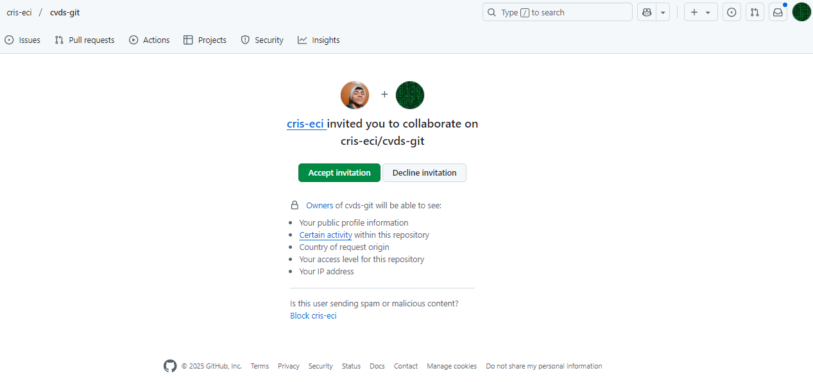
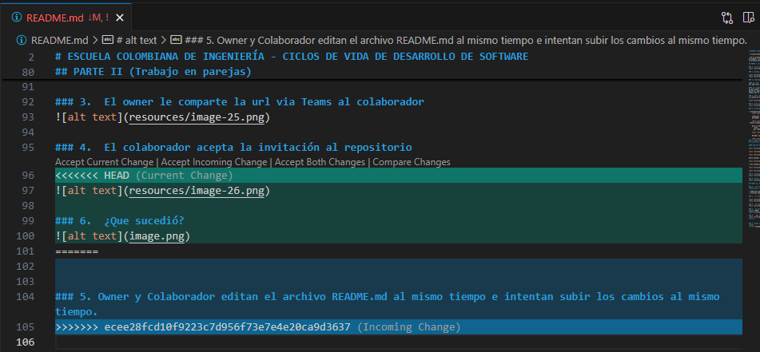
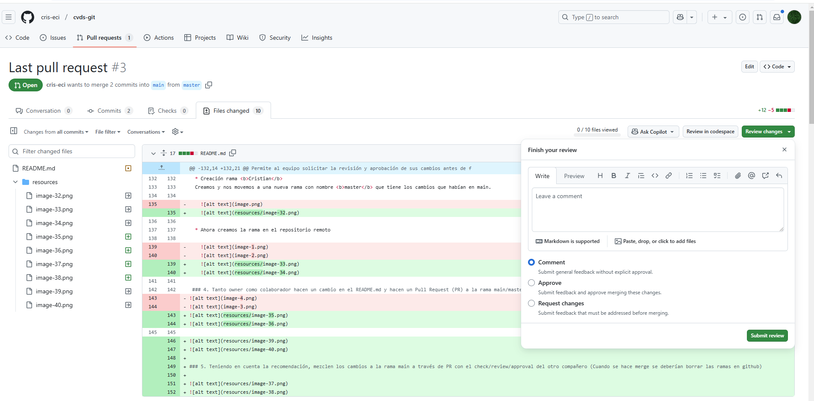
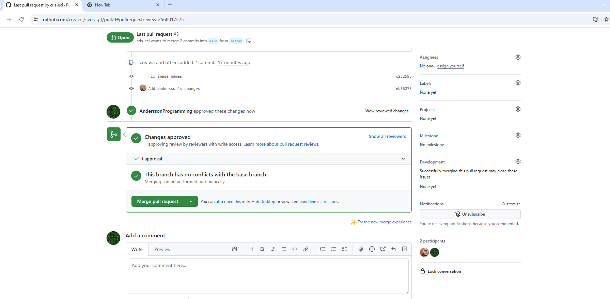
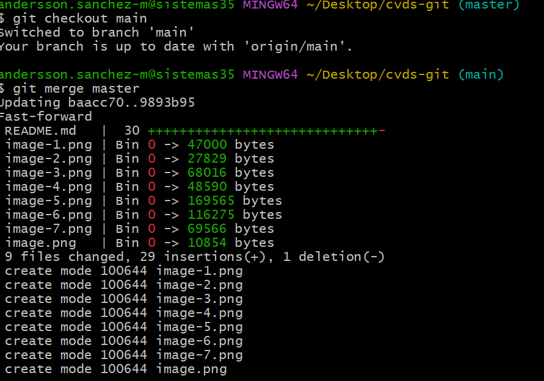

# ESCUELA COLOMBIANA DE INGENIERÍA - CICLOS DE VIDA DE DESARROLLO DE SOFTWARE

 

- En el presente laboratorio vamos a aprender los manejos básicos de GitHub, esto con el propósito de que entiendas y comiences a trabajar con esta herramienta. Para este laboratorio se trabajará de manera individual la primera parte y con dos integrantes en la segunda parte.
  
## PARTE I (Trabajo Individual). 

### 1. Crea un repositorio localmente.


### 2. Agrega un archivo de ejemplo al repositorio, el README.md puede ser una gran opción.


### 3. Averigua para qué sirve y como se usan estos comandos git add y git commit -m “mensaje”

#### Git add
Git add sirve para agregar los archivos que no han sido agregados al staged o area de trabajo.

#### git commit -m "mensaje"
El git commit sirve para guardar los cambios de los archivos que ya están en el stage y son a forma de metáfora, guardados en una imagen congelada en el tiempo. Ahora, el -m "mensaje" sirve para indicar el tipo de cambio que se hizo.

### 4. Abre una cuenta de github, si ya la tienes, enlazala con el correo institucional.
La cuenta de GitHub ya la había creado y enlazado el semestre pasado con mi cuenta institucional.


### 5. Crea un repositorio en blanco (vacío) e GitHub


### 6. Configura el repositorio local con el repositorio remoto.

* Configuración inicial, local credentials
    

    cambiamos el nombre de la rama
    de master a main

    
* Ahora enlazamos el repositorio local con el remoto. 

    Esto lo hacemos con: 
    ```bash
      git remote add origin https://github.com/cris-eci/cvds-git.git
    ```
    

    Hacemos un fetch y un push para sincronizar. 

    
### 7. Sube los cambios, teniendo en cuenta lo que averiguaste en el punto 3 Utiliza los siguientes comando en el directorio donde tienes tu proyecto, en este orden

#### Edición README en editor
 


Ahora hacemos un push 


Y nos autenticamos


### 8. Configura el correo en git local de manera correcta


### 9. Vuelve a subir los cambios y observa que todo esté bien en el repositorio remoto (en GitHub).


## PARTE II (Trabajo en parejas)

### 1.	Se escogen los roles para trabajar en equipo, una persona debe escoger ser "Owner" o Propietario del repositorio y la otra "Collaborator" o Colaborador en el repositorio.

* Andersson David Sanchez Mendez - <b>Colllaborator</b>
* Cristian Santiago Pedraza Rodriguez -  <b>Ownner</b>

### 2.	El owner agrega al colaborador con permisos de escritura en el repositorio que creó en la parte 1


### 3.	El owner le comparte la url via Teams al colaborador


### 4.	El colaborador acepta la invitación al repositorio



### 5. Owner y Colaborador editan el archivo README.md al mismo tiempo e intentan subir los cambios al mismo tiempo.


### 6.  ¿Que sucedió?


Al intentar hacer el push habían cambios diferentes y hubo conflictos. 
### 7. Resolver conflictos
Los conflictos se arreglaron al dar a la opción <b>accept both changes </b>


### 8.	Volver a repetir un cambio sobre el README.md ambas personas al tiempo para volver a tener conflictos.


### 9.	Resuelvan el conflicto con IntelliJ si es posible

Los conflictos se resolvieron en Visual Studio Code al igual que en el inciso anterior. 


## PARTE III (Trabajo de a parejas)
### 1.	¿Hay una mejor forma de trabajar con git para no tener conflictos?

Si, esa forma consiste en no trabajar todo sobre la main, sino crear una rama nueva, y sobre esa hacer cambios, 
luego cuando esté seguro que el proyecto está bien, entonces se hace el PR, 
para subir y dejar todo en la rama principal (main); usando git flow.


### 2.	¿Qué es y como funciona el **Pull Request**?
Permite al equipo solicitar la revisión y aprobación de sus cambios antes de fusionarlos en la rama principal (main).

### 3.	Creen una rama cada uno y suban sus cambios

  * Creación rama <b>Cristian</b>
  Creamos y nos movemos a una nueva rama con nombre <b>master</b> que tiene los cambios que habían en main. 

    

  * Ahora creamos la rama en el repositorio remoto

    
    
    
 ### 4. Tanto owner como colaborador hacen un cambio en el README.md y hacen un Pull Request (PR) a la rama main/master   
  








## INTEGRANTES

*ANDERSSON DAVID SÁNCHEZ MÉNDEZ*

*CRISTIAN SANTIAGO PEDRAZA RODRÍGUEZ*