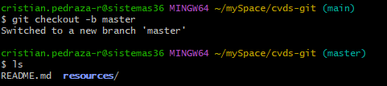
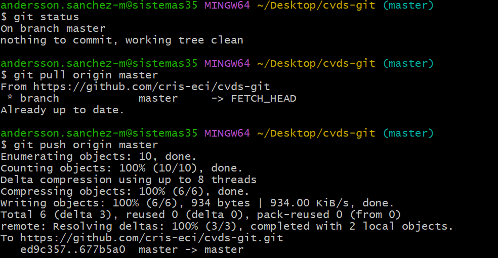
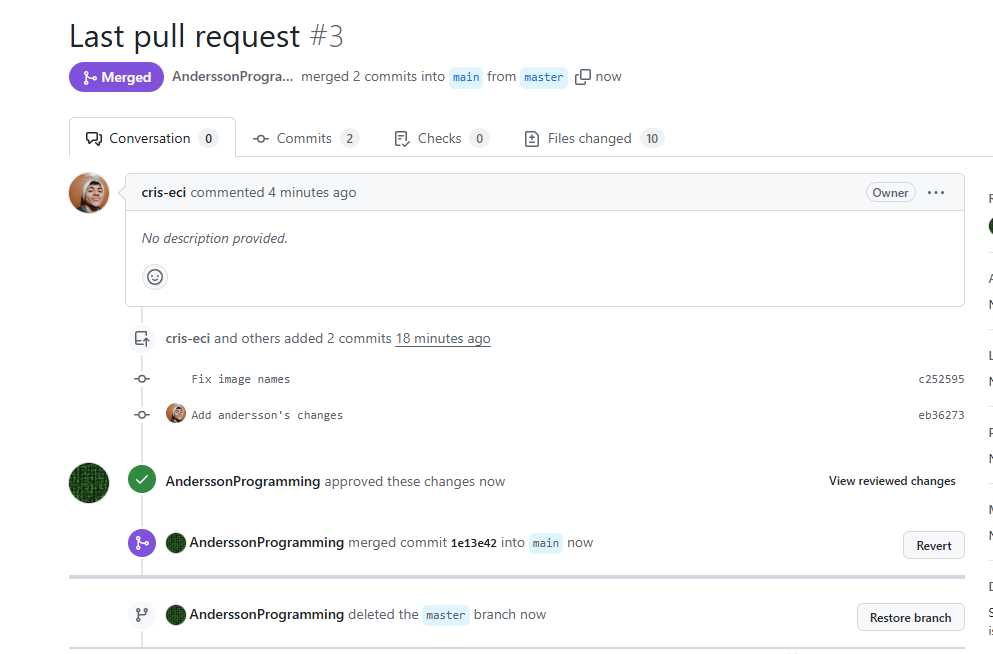

### 1. Crea un repositorio localmente.


### 2. Agrega un archivo de ejemplo al repositorio, el README.md puede ser una gran opción.


### 3. Averigua para qué sirve y como se usan estos comandos git add y git commit -m “mensaje”

#### Git add
Git add sirve para agregar los archivos que no han sido agregados al staged o area de trabajo.

#### git commit -m "mensaje"
El git commit sirve para guardar los cambios de los archivos que ya están en el stage y son a forma de metáfora, guardados en una imagen congelada en el tiempo. Ahora, el -m "mensaje" sirve para indicar el tipo de cambio que se hizo.

### 4. Abre una cuenta de github, si ya la tienes, enlazala con el correo institucional.
La cuenta de GitHub ya la había creado y enlazado el semestre pasado con mi cuenta institucional.



### 5. Crea un repositorio en blanco (vacío) e GitHub


### 6. Configura el repositorio local con el repositorio remoto.

* Configuración inicial, local credentials
    

    cambiamos el nombre de la rama
    de master a main
    
* Ahora enlazamos el repositorio local con el remoto. 

    Esto lo hacemos con: 
    ```bash
      git remote add origin https://github.com/cris-eci/cvds-git.git
    ```
    
    Hacemos un fetch y un push para sincronizar. 
    
### 7. Sube los cambios, teniendo en cuenta lo que averiguaste en el punto 3 Utiliza los siguientes comando en el directorio donde tienes tu proyecto, en este orden

#### Edición README en editor
 





Ahora hacemos un push 

Y nos autenticamos


